#  Santhosh Thiruvengadam

<div align="center">

<!-- Animated Typing SVG -->
<a href="https://git.io/typing-svg"></a>

<br/>

<!-- Glowing Badges -->


<br/><br/>

<!-- Contact & Social with High Contrast -->
[](https://github.com/santhoshmdu)
[](https://linkedin.com/in/santhoshmadurai)
[](mailto:sahash1903@gmail.com)
[](tel:+918148983135)

<br/>

<!-- Wave Separator -->


</div>

---

##  Quick Access Dashboard

<table>
<tr>
<td width="50%" valign="top">

###  Live Deployment

<div align="center">

[](https://voter.aramanalytics.com/)

**🎯 99% Accuracy | ⚡ 1500+ RPM | 🔄 Async Processing**


</div>

</td>
<td width="50%" valign="top">

###  Key Metrics

```
┌─────────────────────────────────────┐
│  🎯 Production Systems    →    5+   │
│  🏆 National Awards       →    3    │
│  💰 Total Grants          → ₹1.7L   │
│  📄 Publications          →    1    │
│  🛠️  Tech Stack           →   30+   │
│  ⏱️  Experience           →  11mo   │
└─────────────────────────────────────┘
```

</td>
</tr>
</table>

---

##  Technology Stack Visualization


<details>
<summary><b> Click to Expand: AI/ML Arsenal</b></summary>

<br/>

<div align="center">


**📊 Specializations:**
- ✅ Production OCR with 99% Accuracy
- ✅ Real-Time Video Analytics (X3D)
- ✅ Healthcare Predictive Models (97.8%)
- ✅ Computer Vision Pipelines

</div>

</details>

<details>
<summary><b> Click to Expand: Full-Stack Technologies</b></summary>

<br/>

<div align="center">

**Backend & APIs**


**Frontend**


</div>

</details>

<details>
<summary><b> Click to Expand: Cloud & DevOps</b></summary>

<br/>

<div align="center">


**⚙️ Infrastructure Skills:**
- ✅ EC2 Instance Management
- ✅ S3 Storage & CDN
- ✅ Nginx Reverse Proxy
- ✅ CI/CD Pipelines

</div>

</details>

<details>
<summary><b> Click to Expand: E-commerce Platforms</b></summary>

<br/>

<div align="center">


</div>

</details>

<details>
<summary><b> Click to Expand: IoT & Embedded Systems</b></summary>

<br/>

<div align="center">


**🔌 Hardware Projects:**
- ✅ Air Quality Monitoring System
- ✅ Smart Sensor Networks
- ✅ Real-Time Data Collection
- ✅ IoT Dashboard Integration

</div>

</details>

<details>
<summary><b> Click to Expand: Databases</b></summary>

<br/>

<div align="center">


</div>

</details>

---

##  Featured Project: AI Voter Data Extraction

<div align="center">

###  [🔗 Live Production System](https://voter.aramanalytics.com/)


</div>

###  Technical Architecture



<details>
<summary><b>📊 Performance Metrics Deep Dive</b></summary>

<br/>

```mermaid
%%{init: {'theme':'dark','themeVariables': {'primaryColor':'#00D9FF','primaryTextColor':'#fff','primaryBorderColor':'#00D9FF','lineColor':'#00ff88','secondaryColor':'#1a1a1a','tertiaryColor':'#2d2d2d','fontSize':'14px'}}}%%
graph TB
    subgraph Input["<img src='https://icongr.am/material/file-upload.svg?size=20&color=00D9FF'/> INPUT LAYER"]
        A1["📄 Electoral Roll PDFs"]
        A2["🖼️ Scanned Documents"]
        A3["📸 Image Files"]
    end
    
    subgraph Processing["<img src='https://icongr.am/material/cog.svg?size=20&color=00ff88'/> OPENCV PIPELINE"]
        B1["🎨 Adaptive Thresholding"]
        B2["🔍 Noise Reduction"]
        B3["✨ Enhancement"]
        B4["📐 Preprocessing"]
    end
    
    subgraph AI["<img src='https://icongr.am/material/brain.svg?size=20&color=ff00ff'/> AI ENGINE"]
        C1["🤖 Gemini API"]
        C2["📋 JSON Schema"]
        C3["🎯 Field Extraction"]
        C4["✅ Validation"]
    end
    
    subgraph Async["<img src='https://icongr.am/material/flash.svg?size=20&color=ffd700'/> PERFORMANCE"]
        D1["⚡ AsyncIO Queue"]
        D2["🔄 Rate Limiter"]
        D3["🚀 1500+ RPM"]
        D4["💾 RAM Processing"]
    end
    
    subgraph Output["<img src='https://icongr.am/material/file-download.svg?size=20&color=00ff00'/> OUTPUT"]
        E1["📊 Excel Export"]
        E2["📄 CSV Generation"]
        E3["✔️ Headers Validated"]
        E4["📝 Full Logging"]
    end
    
    A1 --> B1
    A2 --> B2
    A3 --> B3
    B1 --> C1
    B2 --> C2
    B3 --> C3
    B4 --> C4
    C1 --> D1
    C2 --> D2
    C3 --> D3
    C4 --> D4
    D1 --> E1
    D2 --> E2
    D3 --> E3
    D4 --> E4
    
    style Input fill:#1a1a1a,stroke:#00D9FF,stroke-width:3px,color:#fff
    style Processing fill:#1a1a1a,stroke:#00ff88,stroke-width:3px,color:#fff
    style AI fill:#1a1a1a,stroke:#ff00ff,stroke-width:3px,color:#fff
    style Async fill:#1a1a1a,stroke:#ffd700,stroke-width:3px,color:#fff
    style Output fill:#1a1a1a,stroke:#00ff00,stroke-width:3px,color:#fff
```

| Metric | Value | Benchmark | Status |
|--------|-------|-----------|--------|
| **Accuracy** | 99.0% | Industry: 85-90% |  |
| **Processing Speed** | 1500+ RPM | Industry: 500-800 RPM |  |
| **Async Queue** | Producer-Consumer | Standard: Sequential |  |
| **Memory Usage** | RAM-Only | Standard: Disk I/O |  |
| **Output Format** | Excel/CSV | Universal Compatibility |  |

**🔧 Technical Highlights:**
```python
⚡ AsyncIO Architecture → 3x throughput improvement
🎯 Custom Rate Limiter → Prevents API throttling
🔄 Parallel Processing → Multi-threaded image optimization
📊 Gemini Integration → Structured JSON extraction
✅ Error Handling → Complete logging & recovery
```

</details>

---

##  Project Showcase

<table>
<tr>
<td width="50%" valign="top">

###  Real-Time Violence Detection



<div align="center">


```mermaid
%%{init: {'theme':'dark','themeVariables': {'primaryColor':'#ff0000','primaryTextColor':'#fff','primaryBorderColor':'#ff0000','lineColor':'#00ff88','secondaryColor':'#1a1a1a'}}}%%
flowchart LR
    A["📹 Live<br/>Stream"] --> B["16-Frame<br/>Windows"]
    B --> C["🧠 X3D<br/>Model"]
    C --> D{"Confidence<br/>Score"}
    D -->|High| E["🚨 ALERT"]
    D -->|Low| F["✅ Safe"]
    
    style A fill:#1a1a1a,stroke:#00d9ff,color:#fff
    style C fill:#1a1a1a,stroke:#ff00ff,color:#fff
    style E fill:#1a1a1a,stroke:#ff0000,color:#fff
    style F fill:#1a1a1a,stroke:#00ff00,color:#fff
```

**98%+ Precision** | **GPU Accelerated** | **Real-Time**

```mermaid
%%{init: {'theme':'dark','themeVariables': {'primaryColor':'#00ff88','primaryTextColor':'#fff','primaryBorderColor':'#00ff88','lineColor':'#ffd700','secondaryColor':'#1a1a1a'}}}%%
graph LR
    A["⚠️ Imbalanced<br/>Dataset"] --> B["🔍 RFE<br/>Selection"]
    B --> C["⚖️ ADASYN<br/>Balance"]
    C --> D["🎯 XGBoost"]
    D --> E["✅ 97.8%<br/>Accuracy"]
    
    style A fill:#1a1a1a,stroke:#ff6b6b,color:#fff
    style B fill:#1a1a1a,stroke:#00d9ff,color:#fff
    style C fill:#1a1a1a,stroke:#ffd700,color:#fff
    style D fill:#1a1a1a,stroke:#ff00ff,color:#fff
    style E fill:#1a1a1a,stroke:#00ff00,color:#fff
```

</div>

</td>
<td width="50%" valign="top">

###  Hepatitis Prediction Model



<div align="center">


**F1: 0.52→0.72** | **Research Grade** | **Clinical Ready**

</div>

</td>
</tr>
</table>

<details>
<summary><b>📊 Model Performance Comparison</b></summary>

<br/>

```
╔═══════════════════════════════════════════════════════════════╗
║                 HEPATITIS MODEL PERFORMANCE                   ║
╠═══════════════╦══════════════╦══════════════╦═════════════════╣
║  Algorithm    ║    Before    ║    After     ║   Improvement   ║
╠═══════════════╬══════════════╬══════════════╬═════════════════╣
║  XGBoost      ║  F1: 0.52    ║  F1: 0.72    ║    +38.5% ⬆    ║
║  MLP          ║  F1: 0.33    ║  F1: 0.65    ║    +97.0% ⬆    ║
║  Accuracy     ║    89.2%     ║    97.8%     ║     +8.6% ⬆    ║
║  Precision    ║    84.1%     ║    96.3%     ║    +12.2% ⬆    ║
╚═══════════════╩══════════════╩══════════════╩═════════════════╝

🎯 Key Innovation: RFE + ADASYN Pipeline
⚡ Processing: <100ms inference time
✅ Clinical Impact: Early detection of critical cases
```

</details>

---

<table>
<tr>
<td width="50%" valign="top">

###  IoT Air Quality System



```mermaid
%%{init: {'theme':'dark','themeVariables': {'primaryColor':'#00d9ff','primaryTextColor':'#fff','primaryBorderColor':'#00d9ff','lineColor':'#00ff88','secondaryColor':'#1a1a1a'}}}%%
graph TB
    S["🔬 Sensors<br/>MQ-135,DHT11"]
    M["📡 ESP8266<br/>WiFi"]
    F["⚙️ Flask<br/>Backend"]
    D["💾 SQLite<br/>Storage"]
    U["📊 Dashboard<br/>Real-Time"]
    
    S --> M
    M --> F
    F --> D
    F --> U
    D --> U
    
    style S fill:#1a1a1a,stroke:#00d9ff,color:#fff
    style M fill:#1a1a1a,stroke:#00ff88,color:#fff
    style F fill:#1a1a1a,stroke:#ff00ff,color:#fff
    style D fill:#1a1a1a,stroke:#ffd700,color:#fff
    style U fill:#1a1a1a,stroke:#ff6b6b,color:#fff
```

**Monitors:** CO₂ • NH₃ • NOₓ • Smoke • Temp • Humidity

```mermaid
%%{init: {'theme':'dark','themeVariables': {'primaryColor':'#ffd700','primaryTextColor':'#fff','primaryBorderColor':'#ffd700','lineColor':'#00ff88','secondaryColor':'#1a1a1a'}}}%%
mindmap
  root((Smart EV))
    Design
      NX CAD
      Ergonomics
      Weather Shield
    Features
      IoT Sensors
      Monitoring
      Smart Control
    Impact
      1st Place
      ₹40k Grant
      Accessible
```

</td>
<td width="50%" valign="top">

###  Smart Commuter EV



<div align="center">


**Award:** Bharat Cycle Design Challenge  
**Category:** Commuter EV

</div>

</td>
</tr>
</table>

---

##  Professional Journey Timeline


<details>
<summary><b>🎓 Certification Details</b></summary>

<br/>

<table>
<tr>
<th width="40%">Certification</th>
<th width="20%">Provider</th>
<th width="40%">Key Topics</th>
</tr>
<tr>
<td></td>
<td><b>IBM</b></td>
<td>Deep Learning, Neural Networks, TensorFlow, PyTorch, MLOps</td>
</tr>
<tr>
<td></td>
<td><b>IBM</b></td>
<td>Infrastructure, Deployment, Scalability, Microservices</td>
</tr>
<tr>
<td></td>
<td><b>Oracle</b></td>
<td>AI/ML Fundamentals, Model Training, Ethics</td>
</tr>
<tr>
<td></td>
<td><b>CodeChef</b></td>
<td>Data Structures, Algorithms, Problem Solving</td>
</tr>
<tr>
<td></td>
<td><b>Google</b></td>
<td>System Administration, Networking, Security</td>
</tr>
<tr>
<td></td>
<td><b>NPTEL</b></td>
<td>Managerial Skills, Leadership, Agile, Planning</td>
</tr>
</table>

</details>

---

##  Skills Proficiency Matrix


<details>
<summary><b>📊 Skill Level Breakdown</b></summary>

<br/>

```
┌────────────────────────────────────────────────────────────────┐
│                    EXPERTISE DISTRIBUTION                      │
├────────────────────────────────────────────────────────────────┤
│                                                                │
│  AI/ML & Deep Learning    ████████████████████░░  90%         │
│  Backend Development      ███████████████████░░░  85%         │
│  Computer Vision          ████████████████████░░  88%         │
│  Cloud & DevOps          ████████████████░░░░░░  80%         │
│  IoT & Embedded          ██████████████░░░░░░░░  75%         │
│  E-commerce Platforms    ████████████████░░░░░░  78%         │
│  Database Management     ███████████████░░░░░░░  82%         │
│  Frontend Development    ████████████░░░░░░░░░░  70%         │
│                                                                │
└────────────────────────────────────────────────────────────────┘

🎯 Specialization Areas:
  ⚡ Production-Ready AI Systems (99% Accuracy)
  ⚡ Real-Time Video Analytics
  ⚡ Healthcare Predictive Models
  ⚡ Scalable Backend Architecture
```

</details>


---

##  Current Focus & Goals


<div align="center">

### 2026 Objectives

<table>
<tr>
<td align="center" width="33%">


**💼 Professional**

Full-Time AI/ML Role  
Production Systems  
Open Source Contributions

</td>
<td align="center" width="33%">

**🚀 Technical**

Master GenAI & LLMs  
MLOps Expertise  
Advanced Cloud Architecture

</td>
</tr>
</table>

</div>

---

##  Let's Connect!

<div align="center">

<a href="https://github.com/santhoshmdu">

</a>
<a href="https://linkedin.com/in/santhoshmadurai">

</a>
<a href="mailto:sahash1903@gmail.com">

</a>
<a href="tel:+918148983135">

</a>

<br/><br/>

### 📍 Location

**Madurai, Tamil Nadu, India**


<br/><br/>

### 🤝 Open to Collaboration


</div>

---

##  Philosophy

<div align="center">

> **"Building intelligent systems that bridge cutting-edge technology with real-world impact."**

<br/>

### Core Values

<table>
<tr>
<td align="center" width="25%">
<br/>
<b>Innovation</b><br/>
<sub>Pushing Boundaries</sub>
</td>
<td align="center" width="25%">
<br/>
<b>Sustainability</b><br/>
<sub>Eco-Conscious Tech</sub>
</td>
<td align="center" width="25%">
<br/>
<b>Accessibility</b><br/>
<sub>Inclusive Design</sub>
</td>

</table>

<br/>

### 🌱 Continuous Growth

**Always Learning** • **Always Building** • **Always Improving**

<br/>

```
  ╔═══════════════════════════════════════════════════════╗
  ║  "Code is poetry, AI is art, and impact is purpose"  ║
  ╚═══════════════════════════════════════════════════════╝
```

</div>

---


</div>

---

##  Quick Links Reference

<div align="center">

| 🔗 Resource | 📝 Description | 🌐 Link |
|------------|----------------|---------|
| 🗳️ **Live Project** | AI Voter Data Extraction Tool | [Visit](https://voter.aramanalytics.com/) |
| 💼 **GitHub** | Open Source Projects & Code | [@santhoshmdu](https://github.com/santhoshmdu) |
| 🔗 **LinkedIn** | Professional Network | [Connect](https://linkedin.com/in/santhoshmadurai) |
| 📧 **Email** | Direct Communication | [sahash1903@gmail.com](mailto:sahash1903@gmail.com) |
| 📱 **Phone** | WhatsApp / Call | [+91-81489-83135](tel:+918148983135) |

</div>

---

<div align="center">

###  Thanks for Visiting!


<br/><br/>

**If you like my work, consider giving a ⭐ to my repositories!**

<br/>

<sub>⚡ Powered by Passion | 🎯 Driven by Innovation | 💻 Built with Code</sub>

<br/>


---

<sub>**Made with**  **and**  **by Santhosh Thiruvengadam**</sub>

**© 2025 Santhosh Thiruvengadam | All Rights Reserved**

</div>
